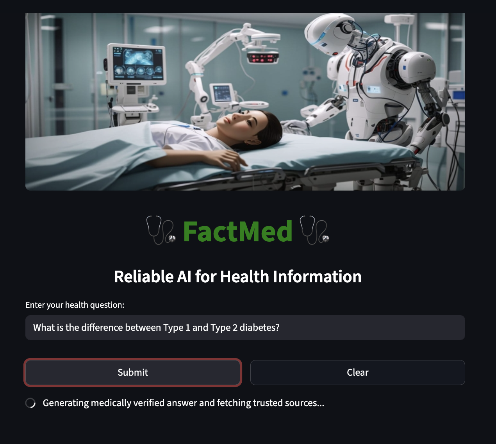
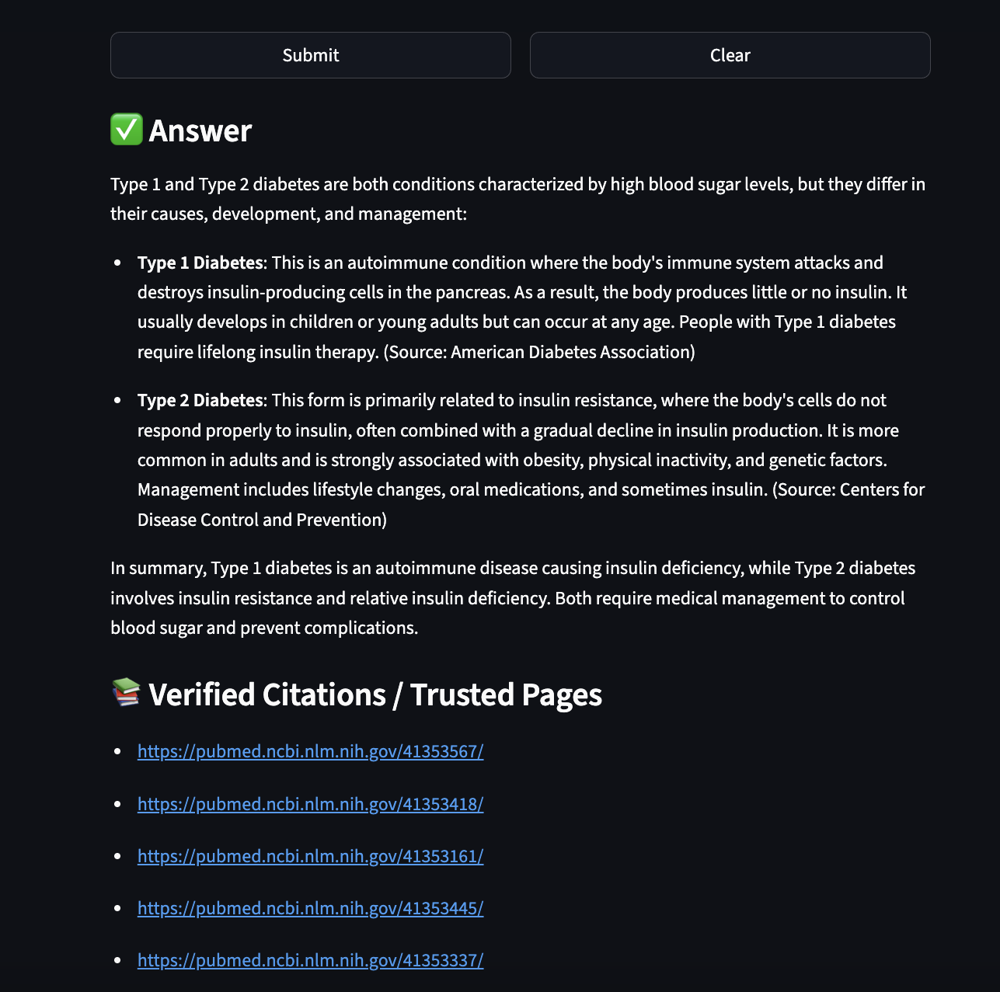
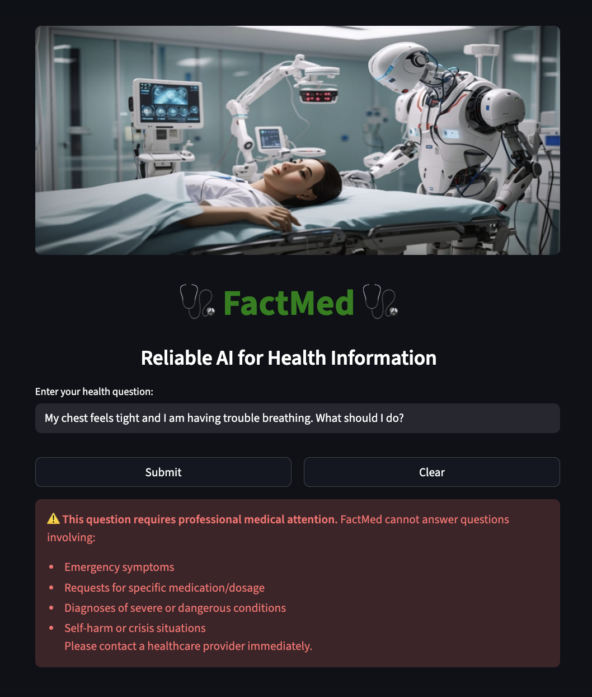

# FactMed 🩺 - Healthcare AI Assistant

**FactMed** is an AI-powered web application designed to provide **safe, reliable, and evidence-backed health information**. The app leverages OpenAI's GPT-4 to generate answers, integrates PubMed for trusted medical citations, and employs robust safety filters to ensure users receive accurate and responsible medical guidance.

## Key Features

- **AI-Generated Medical Answers:** Powered by OpenAI’s GPT-4, FactMed can answer a wide variety of health-related questions, from symptoms to treatments and everything in between.
- **Evidence-Based Information Retrieval:** The app retrieves trusted citations from reliable sources like PubMed, ensuring that the information provided is scientifically validated.
- **Safety Filters:** FactMed runs a safety check on every user query, flagging potential medical emergencies and providing a disclaimer to seek professional medical attention if necessary.
- **Self-Auditing Mechanism:** After generating an answer, the system performs a self-audit to ensure the response meets safety, accuracy, and reliability standards.
- **Clear Guidance for Irrelevant Queries:** If a question is outside the medical domain, the app gently redirects users to relevant resources and encourages them to ask medically pertinent questions.

## Project Structure


## Installation

### 1. Clone the repository:
```bash
git clone https://github.com/your-username/factmed-health-ai-assistant.git
cd factmed-health-ai-assistant
```

### 2. Set up a Python environment:

It's recommended to use a virtual environment. You can create one with:
```
python -m venv venv
```

Activate the virtual environment:

On macOS/Linux:

```
source venv/bin/activate
```

On Windows:

```
venv\Scripts\activate
```

### 3. Install dependencies:
```
pip install -r requirements.txt
```

### 4. Set up OpenAI API key:

Make sure you have an OpenAI API key and set it in your environment variables:

On macOS/Linux:

```
export OPENAI_API_KEY="your-api-key"
```

On Windows:

```
set OPENAI_API_KEY="your-api-key"
```

### 5. Run the app:
```
streamlit run app.py
```


## How It Works

1. User submits a health-related question:
2. The user enters a health-related query in the input box.
  Safety check:
  - The app first checks if the question involves a potential medical emergency (e.g., severe bleeding, chest pain). If necessary, the app provides a warning to seek immediate medical attention.
3. AI-generated answer:
If the question is deemed safe, FactMed generates an answer using OpenAI’s GPT-4 and retrieves citations from trusted sources like PubMed.
4. Self-audit:
The response undergoes a self-audit to ensure its validity and safety. The system checks for accuracy, potential bias, and whether the information adheres to medical guidelines.
5. Citations:
The app provides links to trusted medical research sources (such as PubMed, NIH, etc.) for further reading, so users can explore more about the answer.

## User Interface


__________________________________________________________________________________________

## Safety screening


